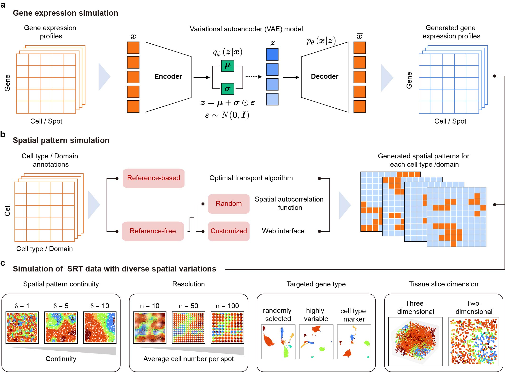

# scCube v2.0.0

## Simulating multiple variability in spatially resolved transcriptomics

[](https://www.python.org/) 

scCube is a Python package for independent, reproducible, and platform-diverse simulation of spatially-resolved transcriptomic data 


## Major updates in v2.0.0
1. **scCube now allows users to consider the heterogeneity within cell types and generate the spatial patterns of cell subtypes flexibly:**
   * [Simulation of the variability of spatial patterns within cell types](tutorial/tutorial_subtype.ipynb) 
2. **scCube now allows users to generate more interpretable spatial patterns in a customized manner:**
   * [Simulation of biologically interpretable spatial basis patterns](tutorial/customized_basis_patterns.ipynb) 
   * [Simulation of highly customized complex spatial patterns](tutorial/customized_complex_patterns.ipynb) 
   * [Demonstration on simulating the tumor-immune microenvironment of TNBC with three archetypical subtypes](tutorial/customized_TME.ipynb)

## Requirements and Installation
[](https://pypi.org/project/anndata/) [](https://pypi.org/project/numpy/) [](https://pypi.org/project/pandas/) [](https://github.com/scverse/scanpy) [](https://pypi.org/project/POT/) [](https://pypi.org/project/matplotlib/) [](https://pypi.org/project/seaborn/) [](https://pypi.org/project/tqdm/)

### Create and activate Python environment
For scCube, the Python version need is over 3.8. If you have installed Python3.6 or Python3.7, consider installing Anaconda, and then you can create a new environment.
```
conda create -n sccube python=3.8
conda activate sccube
```
### Install pytorch
The version of pytorch should be suitable to the CUDA version of your machine. You can find the appropriate version on the [PyTorch website](https://pytorch.org/get-started/locally/).
Here is an example with CUDA11.6:
```
pip install torch --extra-index-url https://download.pytorch.org/whl/cu116
```
### Install other requirements
```
cd scCube-release
pip install -r requirements.txt
```
### Install scCube
```
python setup.py build
python setup.py install
```

## Quick Start (Training new models directly)
scCube requires a **data** file (gene expression profiles) and a **meta** file (cell type/domain annotations) as the input, which can be stored as either `.csv` (read by pandas) or `.h5ad` (loaded by scanpy) formats. We have included two toy datasets in the [tutorial/demo_data folder](tutorial/demo_data) of this repository as examples to show how to use scCube. 

Reference-based simulation:
* [Demonstration of scCube on simulating mouse hypothalamus MERFISH data (same as the spatial reference)](tutorial/demo_merfish_own.ipynb)
* [Demonstration of scCube on simulating mouse hypothalamus MERFISH data (different from the spatial reference)](tutorial/demo_merfish_other.ipynb)

Reference-free simulation:
* [Demonstration of scCube on generating simulated spot-based SRT data](tutorial/demo_spot.ipynb)
* [Demonstration of scCube on generating simulated imaging-based SRT data](tutorial/demo_image.ipynb)

For more details about the format of input and the description of parameters, see [here](tutorial/API.md).

## Trained models and datasets
In the current version, scCube includes about **300** trained models of various tissues derived from four human and mouse scRNA-seq atlas (Tabula Muris, Tabula Sapiens, MCA, and HCL) as well as high-quality SRT datasets. Detailed information about these models and datasets can be found [here](tutorial/statistics.md).

## Tutorials (loading trained models provided by scCube)
Additional step-by-step tutorials are now available! Users can employ the trained models conveniently through the Python package to generate the new gene expression profiles of specific tissues. We provide the following tutorials as examples:

Reference-based simulation:
* [Using scCube to simulate the mouse hypothalamus MERFISH data](tutorial/tutorial_merfish.ipynb)
* [Using scCube to simulate the human DLPFC 10x Visium data](tutorial/tutorial_dlpfc.ipynb)
* [Using scCube to simulate the mouse cortex STARmap data](tutorial/tutorial_starmap.ipynb)
* [Using scCube to simulate the human breast cancer ST data](tutorial/tutorial_bc.ipynb)

Reference-free simulation:
* [Using scCube to simulate diverse spatial patterns](tutorial/tutorial_pattern.ipynb)
* [Using scCube to simulate 3D spatial patterns](tutorial/tutorial_3d.ipynb)
* [Using scCube to simulate spatial patterns for user-specified cell types](tutorial/tutorial_specified.ipynb)
* [Using scCube to simulate the variability of resolution and spot arrangement of spot-based SRT data](tutorial/tutorial_resolution.ipynb)


## About
scCube was developed by Jingyang Qian. Should you have any questions, please contact Jingyang Qian at qianjingyang@zju.edu.cn.

